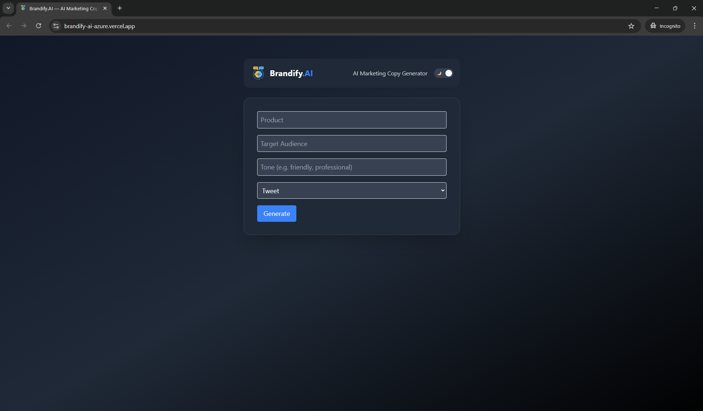
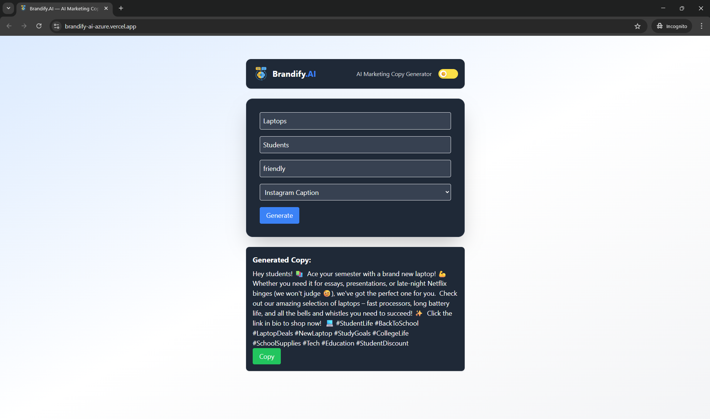

# 🌟 Brandify.AI

**Brandify.AI** is a modern generative marketing assistant that helps small businesses craft engaging content for social media and marketing campaigns using AI. Just input your product details or campaign goals, and Brandify.AI will generate high-converting slogans, captions, tweets, or blog outlines — instantly!

<br/>

## 🌐 Live Preview - [Brandify.AI](https://brandify-ai-azure.vercel.app/)

<br>

## 🚀 Features

- 📝 Input product/brand details
- 🎯 Choose content type (Tweet, Instagram caption, blog outline, etc.)
- 🧠 Generate AI-written marketing copy using Gemini 1.5 Flash
- 🌈 Select tone of voice (e.g., Professional, Casual, Funny, Bold) for personalized results
- 📤 Copy or share generated content
- 🌙 Dark mode support for modern UI

<br/>

## 🧠 Powered By

- **Gemini 1.5 Flash (Google AI Studio)** – Fast and lightweight generative model ideal for real-time text generation
- **Prompt Templates** – Smart templates like  
  `"Write a 30-word Instagram ad for [product] targeting [audience]. Use a [tone] tone, include emojis and hashtags."`

<br/>

## 🛠 Tech Stack

| Layer     | Tech                      |
|-----------|---------------------------|
| Frontend  | React (Vite), Tailwind CSS |
| Backend   | Node.js, Express          |
| AI Model  | Gemini 1.5 Flash via Google AI Studio  |
| Hosting   | Vercel (Frontend), Render (Backend) |

<br/>

## 🎥 Demo



<br>

## 🧪 Run Locally

### 1. Clone the repo
```bash
git clone https://github.com/Shivang-7/brandify-ai.git
cd brandify-ai
```
### 2. Setup Backend
```bash
cd backend
npm install
echo "GEMINI_API_KEY=your_api_key_here" > .env
node index.js
```
### 3. Setup Frontend
```bash
cd ../frontend
npm install
npm run dev
```

<br/>

## 📚 Learnings & Highlights

- 🧩 Hands-on experience in prompt engineering  
- 🖼️ Built a fully functional full-stack app using modern tools  
- 🎯 Applied Generative AI to solve real business content problems  
- 📂 Mastered deployment with Vercel & Render

<br>

## 📄 License

This project is licensed under the [MIT License](./LICENSE).  
